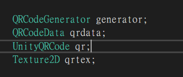
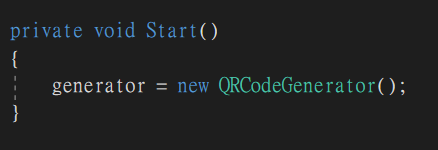
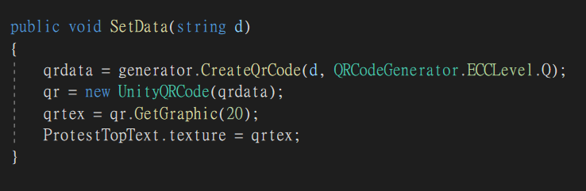

# package_qrcoder

A package that simply generate the qrcode\
This package use [qrcoder](https://github.com/codebude/QRCoder) dependency\
For any problem that need to be solve beyond qrcode texture 2d generation, you can go here.

## How To Use It ?

We need below elements in order to generate a QR code texture2D target

Let's init the generator first, this can be reuse afterward

Create a set data function\
ProtestTopTest is RawImage instance

